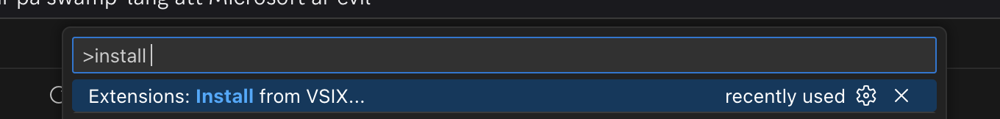

+++
title = "Install"
+++

The Visual Studio Code extension includes the Swamp compiler, but it's highly recommended to also install the CLI for running swamp commands from the terminal.

**Note:** To run compiled Swamp programs, you'll also need an engine, e.g. [`moss`](https://moss32.com/install/).

### Visual Studio Code Extension

The VS Code extension includes the Swamp compiler and provides syntax highlighting and error checking.

Since Microsoft is not a nice company, we prefer that you download the vsix manually. But otherwise search in your vscode fork or alternative extension marketplace if the "Swamp (beta)" is available.

Download the VSIX extension, then run `Extensions: Install from VSIX...` in the command palette.



[swamp-beta-0.0.29.vsix](/downloads/swamp-beta-0.0.29.vsix)

### Brew

on macOS and Linux please use [Brew](https://brew.sh/) to get **swamp**:

```sh
brew tap swamp/tap
brew install swamp-beta
```

(tap only needs to be added once)

### Scoop

on Windows use [Scoop](https://scoop.sh/) to get **swamp**:

```sh
scoop bucket add swamp https://github.com/swamp/scoop-bucket
scoop install swamp
```

(bucket only needs to be added once)

### Verify Installation

Check that swamp is installed correctly:

```sh
swamp
```

It should output the version number and help information. At this time it should be at least `v0.3.5`

## Get started

### Minimal Test Example

create a `main.sw` file:

```swamp
for _ in 0..3 {
    print("hello world!")
}
```

Compile with

```sh
swamp build
```

and it will output a `main.swim` binary.

Then run that binary with [`moss`](https://moss32.com/install/):

```sh
moss main.swim
```

## Next Steps

Since Swamp compiles to Marsh VM artifacts, you can use them in various engines:

- [Lily2d](https://lily2d.com/) - a 2D game engine, mainly for indie games.
- [Moss32](https://moss32.com/) - a retro fantasy console.

---

### Manual Install (Not Recommended)

Manual installation requires setting up PATH and dealing with OS-specific permissions. Use the package managers above instead.

If you still need it: download the swamp executable from [releases](https://github.com/swamp/swamp/releases).
